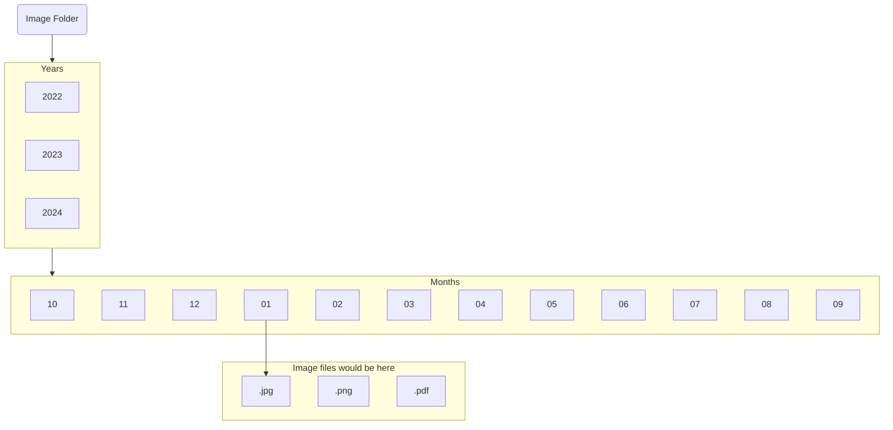

# Objective
We want to automate a shell script file that allows us to organize our files in our computer so that it may be nice, neat and easy to access. 

In this project I will be using it to organize image file so the it may be sorted in its' proper folder but feel free to make the necessary adjustment to organize any other files besides `.jpg`

# Flowchart 
> This is how the `Image Folder` should look after running the organized file. Remember, `Years`, `Months`, and `Image files would be here` are labeled to indicate the layers and are not actual folders. 
> 
> The folders are `Image Folder` and files inside `Year`, `Months`, and `Image file would be here` layers


---
# **Required Installation**

## For Ubuntu/Debian:
```bash
sudo apt-get install libimage-exiftool-perl
```

## For MacOS (using Homebrew):
```bash
brew install exiftool
```

---
# Step 1
Locate to the director that you want to be organized. 
Then create a script file here. For this project we will be using `bash`
- You may this do by opening up your favorite editor then title it and saving it as a `.sh`
	- Example: `organize_file.sh`  
- You may also do this is a `bash` terminal by doing the following:
	- `nano organize_file.sh` then start coding. **Be sure to save your file after finishing!**

# Step 2
In your `organize_file.sh` file include the a shebang `#!/bin/bash` because this will indicate that this file will be a bash script. 

We create a `Image Folder` were we would store all of our `.jpge` (but of course as mentioned previously feel free to include other image file extensions like `.pdf`, `.png`,`.gif`, etc.).
```bash
mkdir "Image Folder"
```

 Let's move all of our `.jpg` files into to the `Image Folder`.
```bash
mv *.jpg "Image Folder"
```

Then we will navigate to the directory we previously create. If it doesn't exist then we will exit.
```bash
cd "Image File" || exit
```

Now we run for loops using the information retrieved from the image files of all the images. We will be using `exiftool` for this part so be sure that you've installed the proper tool. Check the **Required Installation** of you haven't done so. 
```bash
# Organize file by Month and Year
for file in *.jpg; do

    if [[ -f "$file" ]]; then
        # Get the year and month from EXIF data
        year=$(exiftool -d "%Y" -DateTimeOriginal -S -s "$file")
        month=$(exiftool -d "%m" -DateTimeOriginal -S -s "$file")

        # If EXIF data is not available, fallback to file modification date
        if [[ -z "$year" ]]; then
            year=$(stat -c %y "$file" | cut -d'-' -f1)
        fi

        if [[ -z "$month" ]]; then
            month=$(stat -c %y "$file" | cut -d'-' -f2)
        fi

        # Create directories for the year and month if they don't exist
        mkdir -p "$year/$month"

        # Move files to the appropriate directories
        mv "$file" "$year/$month"
    fi

done

echo "All image files are done being organize!"
```

# Automatic-File-Organizer
